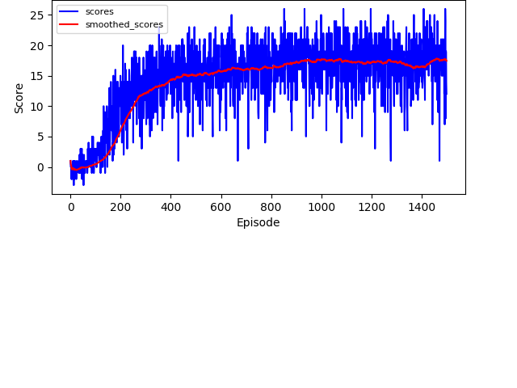

### Banana Collection Navigation

####1. DQN Model and Learning Algorithm

In the Unity Banana Collection project, I use these DQN algorithm enhancement, including `Double DQN`, `Priortized Experience Replay (PER)` and `Dueling DQN` methods.

The model structure are as follows:

```text
DQNNetwork(
  (hidden): Sequential(
    (0): Linear(in_features=37, out_features=64, bias=True)
    (1): LeakyReLU(negative_slope=0.01)
    (2): Linear(in_features=64, out_features=64, bias=True)
    (3): LeakyReLU(negative_slope=0.01)
  )
  (V): Linear(in_features=64, out_features=1, bias=True)
  (A): Linear(in_features=64, out_features=4, bias=True)
)
```

The model parameters are as follows:

1.1 Table: training parameters


| Parameter Name | Parameter Value | Remarks |
| -------------  |:-------------:  | -----:  |
| n_epochs       | 1500            | number of epochs |
| epsilon        | 1.              | initial epsilon-greedy value |
| epsilon_decay  | 0.99            | epsilon decay multiplier after each epoch |
| epsilon_min    | 0.005 | the lower limit of epsilon |
| batch_size     | 32    | batch size |
| learning_rate  | 1e-4  | learning rate |
| gamma  | 0.95  | parameter for setting the discounted experiences of future rewards |
| replay_buffer_size  | 10000  | size of replay buffer |
| local_tau  | 1e-4  | interpolation parameter for updating target model parameters |
| training_steps  | 3  | how many steps to train the model |
| smoothed_window | 100 | how many epochs to calculate smoothed scores |


1.2 Table: Prioritized Replay Buffer parameters

| Parameter Name | Parameter Value | Remarks |
| -------------  |:-------------:  | -----:  |
| replay_buffer_size  | 10000  | size of replay buffer |
| alpha  |  0.6  | the importance of TD error to priority |
| beta  |  0.4  | importance-sampling, from initial experiences increasing to 1 |
| beta_increment_per_sampling  |  0.001  | the increment of beta after each sample step |
| epsilon  |  0.01  | the increment of every TD error to avoid 0 |
| abs_err_upper  |  1.  | the upper limit of every TD error |
| min_prob_lower  |  1.e-6  | the lower limit of minimum priority |


####2. Performance Analysis

Figure 1: Performance on the Unity Banana Collection using the hyper-parameters as above


From the figure above, we can see the scores are increased slowly after about epoch 400.

####3. Future Work

3.1 Try to adjust the hyper-parameters to make it more fast after epoch 400.

3.2 Try to train pixel banana collection environment on GPU machine.

```text
PixelDQNNetwork(
  (hidden): Sequential(
    (0): Conv2d(3, 16, kernel_size=(5, 5), stride=(2, 2))
    (1): BatchNorm2d(16, eps=1e-05, momentum=0.1, affine=True, track_running_stats=True)
    (2): ReLU()
    (3): MaxPool2d(kernel_size=2, stride=2, padding=0, dilation=1, ceil_mode=False)

    (4): Conv2d(16, 32, kernel_size=(3, 3), stride=(1, 1))
    (5): BatchNorm2d(32, eps=1e-05, momentum=0.1, affine=True, track_running_stats=True)
    (6): ReLU()
    (7): MaxPool2d(kernel_size=2, stride=2, padding=0, dilation=1, ceil_mode=False)

    (8): Conv2d(32, 64, kernel_size=(3, 3), stride=(1, 1))
    (9): BatchNorm2d(64, eps=1e-05, momentum=0.1, affine=True, track_running_stats=True)
    (10): ReLU()
    (11): MaxPool2d(kernel_size=2, stride=2, padding=0, dilation=1, ceil_mode=False)
  )
  (fc1): Sequential(
    (0): Linear(in_features=576, out_features=32, bias=True)
    (1): LeakyReLU(negative_slope=0.01)
  )
  (V): Linear(in_features=32, out_features=1, bias=True)
  (A): Linear(in_features=32, out_features=4, bias=True)
)
```
