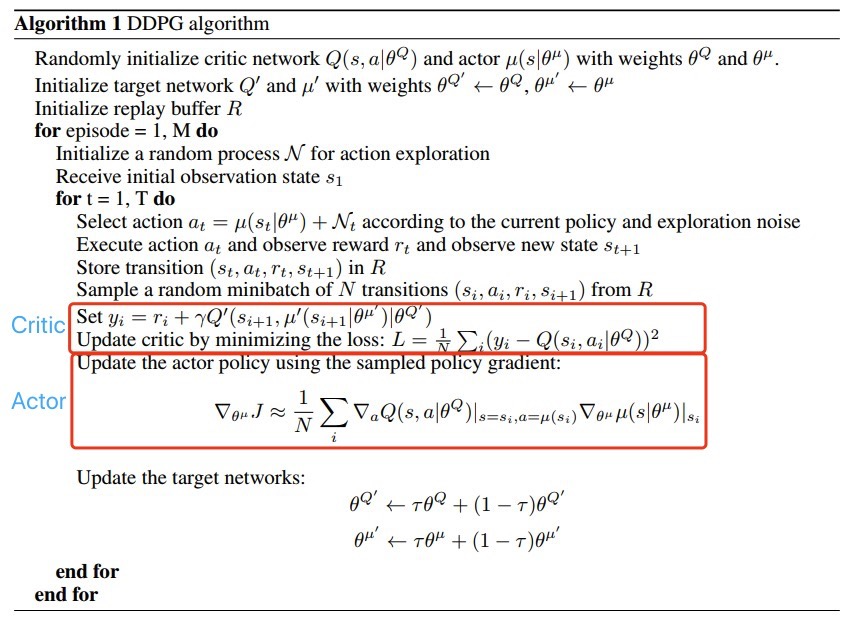
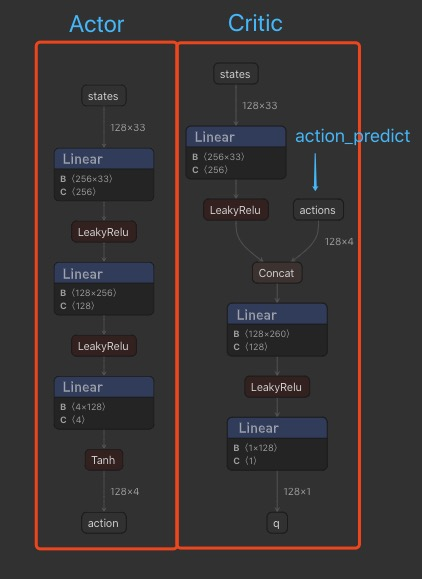
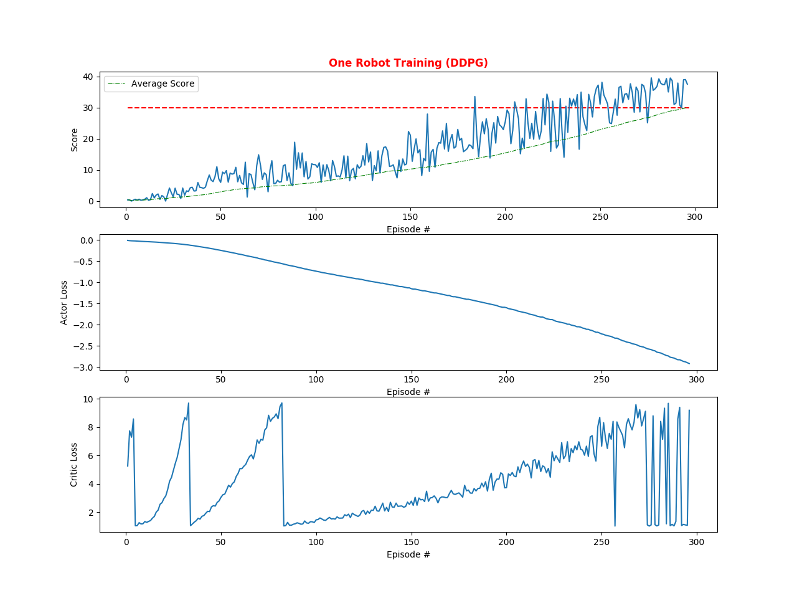

<script type="text/javascript" src="http://cdn.mathjax.org/mathjax/latest/MathJax.js?config=TeX-AMS-MML_HTMLorMML"></script>
<script type="text/x-mathjax-config">
    MathJax.Hub.Config({ tex2jax: {inlineMath: [['$', '$']]}, messageStyle: "none" });
</script>

# Report

This report is my second project of Udacity's Deep Reinforcement Learning on the Unity Reacher environment. The goal of the project is to train an robot's arm with two joints to track a balloon target and the deep deterministic policy gradient method (DDPG) is used to solve the problem.

## 1. Background

### 1.1 Preliminaries

Reinforcement Learning addresses the problem of how agents should learn to take actions (Policy $\pi^*$) to maximize expected total utility $U_\theta$ through interactions with the environment, which is defined as follows: an agent interacts with its surrounding environment through a sequence of observations $s_t$, actions $a_t$ and rewards $r_t$. Here, actions $a_t$ are real-valued and rewards $r_t$ are functions w.r.t $s_t$ and $a_t$. The return from a state is defined as the sum of discounted future rewards $R_\tau=\sum\limits_{t=0}^{\Tau}\gamma^tr(s_t,a_t)$ with a discounting factor $\gamma\,\subset\,[0,1]$. For policy $\pi$, there are two policies:

-  A **deterministic policy**: $\mathcal{S}\, \to\, \mathcal{A},\;a=u(s)$ , it yields the action a.
- A **stochastic policy**: $\mathcal{S} \times \mathcal{A} \to [0,1],\;\pi(a|s)=P[a|s]$, it yields the action probability.

The `action-value function` for a policy $\pi$ is denoted $Q^\pi(s_t, a_t)$ or $Q_{P_\theta}(s_t, a_t)$, For each state $s \in\mathcal{S}$ and action $a \in\mathcal{A}$, it yields the expected return if the agent starts in state $s$, takes action $a$, and then follows the policy for all future time steps. It is proven that if the policy is optimal, then this function is also maximum.

$$
An\;optimal\;policy\ \pi^* 
\\\quad = argmax_{\pi}(U_\theta)
\\\quad = argmax_{\pi}(E_{\pi}(R_\tau))
\\\quad = argmax_{\pi}(E_{\pi}[\sum\limits_{t=0}^{\Tau}\gamma^tr(s_t,a_t)]) 
\\\quad = argmax_{a}(E_{\tau\sim{P_\theta(\tau)}}[\sum\limits_{t=0}^{\Tau}\gamma^tr(s_t,a_t)]) 
\\\quad  = argmax_{a}(\sum\limits_{\tau}P_\theta(\tau)[\sum\limits_{t=0}^{\Tau}\gamma^tr(s_t,a_t)]) 
\\\quad = argmax_{a}(E_{s_0\sim{P_\theta(s_0)}}[E_{a_0 \sim P_\theta(a_0|s_0)}[Q_{P_\theta}(s_0, a_0 | s_0)]]) 
\\\quad ,whereby\ trajetory\;\tau=\{s_0,a_0,s_1,a_1,...,s_\Tau,a_\Tau\}, 
\\\quad discounting\;factor\;\gamma\,\subset\,[0,1],
\\\quad policy\;\pi = \lgroup_{\mathcal{S}\,\times\,\mathcal{A}\;\to\;[0,1],\quad For\; stochastic\; policy:\;for\;s\,\subset\,\mathcal{S},\; it\; yields\; the\; probability \; \pi_\theta(a|s) = P_\theta(a|s)}^{\mathcal{S}\, \to\, \mathcal{A},\quad For \; deterministic \; policy:\;for\;s\subset\mathcal{S},\;it\; yields\;the\;action\;a\,\subset\,\mathcal{A}}, 

\tag{1}
$$

Generally speaking, there are two main categories to solve the above problem:

- **Model-based Method**: To mode the transition probability $P$ and rewording function $R$ to get the optimal solution by using the traditional method **Markov Decision Processes (MDPs)**.

- **Model-free Method**: Do not find the fitting $P$ and $R$, but use function approximation or direct policy enforcement, which is what we focus on.

**Value-based method** such as DQN has shown great success in some domains. To determine the optimal policy $\pi^*$, we must compute the value function for each state firstly,which is indrect and limited to the discrete action space environments and deterministic policies.

**Policy-based method**, on the other hand, can directly find the optimal policy without calculating a value function. It is direct and also works well in continuous action spaces, please refer to the following table.

|              |         Value Function         | Policy                          |
| ------------ | :----------------------------: | ------------------------------- |
| Value-based  | $\hat{q}(s,a)\approx q_*(s,a)$ | $\pi(\hat{q}(s,a))\approx\pi^*$ |
| Police-based |               —                | $\pi\approx\pi^*$               |


### 1.2 Stochastic Gradient Ascent Algorithm

Policy gradient methods are a subclass of policy-based methods that estimate the weights of an optimal policy through gradient ascent. Using policy gradient method, we can maximize $U_\theta$ by computing its gradient with respect to $\theta$, which can be readily be derived to be:

$\nabla_\theta U_\theta = E_{\tau\sim P_\theta(\tau)}[\sum \limits_{t=0}^\Tau (\nabla_\theta log(P_\theta(a_t|s_t))(\sum\limits_{t=0}^\Tau\gamma^tr(s_t,a_t)))]  =\sum\limits_\tau P(\tau;\theta)\nabla_\theta logP(\tau;\theta)R(\tau) \tag{2}$

A more efficient approach is to using **Stochastic Gradient Ascent** to change the $\theta$ in the direction of the gradient as follows:

$\theta=\theta+\alpha\nabla_\theta U_\theta, \; \alpha\;is\;the\;learning\;rate \tag{3}$

### 1.3 REINFORCE Algorithm

The Equation (2)  is an expectation, which can be approximately estimated by sampling, that is, sample the trajectorys according to $\tau \approx P_\theta(\tau)$ by using the policy $\pi_\theta$ to estimate the gradient $\nabla_\theta U_\theta$ and here is the gradient of the **REINFORCE** algorithm
$$
\nabla_\theta U(\theta) \approx \hat{g} = \frac{1}{m}\sum\limits_{i=1}^m(\nabla_\theta logP(\tau^{(i);\theta})R(\tau^{(i)}))  = \frac{1}{m}\sum\limits_{i=1}^m(\sum\limits_{t=0}^\Tau(\nabla_\theta log(P_\theta(a_t|s_t))(\sum\limits_{t=0}^\Tau\gamma^tr(s_t,a_t))) 

\tag{4}
$$
Note that the reason why the above estimator is valid because the trajectories are generated by following the policy being learned, i.e. it is an on-policy algorithm. Another way to say it is that we sample each of the trajectories in $\{\tau^1,\tau^2,...,\tau^m\}$  from the probability distribution $P_\theta(\tau)$ and each $\tau^{(i)}$ is a sampled trajectory.

We start with random values of $\theta$ and repeat the following 3 steps until convergence:

1. Use the policy $P_\theta(a_t|s_t)$ to collect $m$ trajectories $\{\tau^1,\tau^2,...,\tau^m\}$, where each trajectory is as defined above.
2. Use these trajectories and Monte-Carlo estimator of gradients to calculate the gradient values as Equation (4).
3. Update model parameters according to Equation (3).


The intuition behind the **REINFORCE** algorithm is that if the total reward is positive, then all the actions taken in that trajectory are reinforced whereas if the total reward is negative, then all the actions taken in the trajectory are inhibited. Moreover, to be computationally efficient, typically m is set to 1.

Though the aloghrithm is better than stochastic optimization methods, there exists three issues:

1. The update process is very **inefficient**! We run the policy once, update once, and then throw away the trajectory.
2. The gradient estimate $\hat{g}$ is very **noisy**. By chance the collected trajectory may not be representative of the policy.
3. There is no clear **credit assignment**. A trajectory may contain many good/bad actions and whether these actions are reinforced depends only on the final total output.

Besides the Monte-Carlo estimator of the gradient $\hat{g}$ is unbiased, but has high variance. The following algorithms discussed bellow are used to reduce the variance without introducing bias: 1) using causality and 2) using a baseline.

### 1.4 Proximal Policy Optimization (PPO) Algorithm

The algorithm is used to solve the issues mentioned of the **REINFORCE** algorithm:

1. Noise Reduction: using distributed computing to collect multiple trajectories in parallel.
2. Rewards Normalization: Just like batch-normalization technique, it helps improve learning.
3. Credit Assignment: We use future reward instead of the total reward to calculate, because if an action is taken, it won't affect the past rewards. 

The formula is ignored, if you interested, please read the paper through [this link](https://arxiv.org/abs/1707.06347)

### 1.5 Stochastic Actor-Critic Algorithm

According to Equation (2), we can use another representation:
$$
\nabla_\theta U_\theta =\sum\limits_\tau P(\tau;\theta)\nabla_\theta logP(\tau;\theta)R(\tau)
\\\quad = E_{s\sim{\rho^{\pi_\theta}},a\sim {\pi(s)}}[\nabla_\theta log\pi(a|s)Q^{\pi_\theta}(s,a)]
\tag{5},
\\\quad where\;\rho^{\pi_\theta}is\;the\;state\;distribuation\;using\;the\;policy\;\pi_\theta
$$
We can use function proximation method to estimate the `action-value function`to get the estimator $\hat{Q}(s,a;w)$, then we get the **Stochastic Actor-Critic** algorithm. It consists of two eponymous components: An `Actor` adjusts the parameter $\theta$ of the stochastic policy $\pi_\theta(s)$ by stochastic gradient asenct of Equation (5). Instead of the unknown true action-value function $Q^\pi(s,a)$ in Equation (5), an action-value function $Q^\pi(s,a;w)$ is used with parameter vector $w$.  A `critic` estimates the action-value function $Q^\pi(s,a) \approx Q^\pi(s,a;w)$ using an appropriate policy evaluation algorithm such as temporal-difference (TD) learning.

The significant difference between **REINFORCE** algorithm and **Actor-Critic** algorithm is the latter adding a function aproximator, such as Q-network, which can be seen as a valued-based method. One of the functionality of critic part is to reduce the variance without changing the bias.

If we use advantage function $A$ to estimate the action-value function $Q^\pi(s,a)$, then we get **Advantage Actor-Critic** algorithm, the asynchronous version is called **Asynchronous Advantage Actor-Critic** algorithm.

### 1.6 Deterministic Policy Gradient (DPG) Algorithm

These above in Policy-based domain are all above stochastic polices, while it also has been proven that deterministic policies are also exists for model-free method, this is to say, to let the policy function output the action itself ( $a=u(s|\theta)$ ). 

In continuous action spaces, for deterministic actions, the **Actor-Critic** mentioned in chapter1.5 will involves complexity and computational burden. To address these short comings, for deterministic actions, we can use the **Deterministic Policy Gradient (DPG)** algorithm.
$$
\nabla_\theta U_\theta = E_{s_t\sim{\rho^{\pi_\theta}}}[\nabla_a Q(s,a;w)\nabla_{\theta}u(s|\theta)|_{s=a_t,a=u(s_t)}]
\\\quad where\;\rho^{\pi_\theta}is\;the\;state\;distribuation\;using\;the\;policy\;\pi_\theta

\tag{6},
$$
Essentially, DPG is still a version of **Actor-Critic** algorithm with deterministic actions. The `Actor` network (parameterized by $\theta$ ) is estimating the optimal target policy and the `Critic` network (parameterized by $w$ ) is estimating the action-value function coresponding to the target policy.

## 2.  Deep Deterministic Policy Gradients (DDPG) Algorithm

Compare this with **Deterministic Policy Gradient (DPG)** algorithm, it imposes Deep Learning to approximate the policy function $u$ (Actor network) and $Q$ function (Critic network). The training process are as follows in the [paper](https://arxiv.org/abs/1509.02971):



In the project, there are two environments: `One Agent Environment` and `Twenty (20) Agents Environment`. For the both two environments, we use DDPG algorithm to solve them. `Continuous_Control_DDPG_First_Version.ipynb` is used for the first environment and `Continuous_Control_DDPG_Second_Version.ipynb` for the second one. These two files of the algorithm are almost the same, except that the latter one have smaller steps to retrain the model, because for each training steps, the latter will generate more training experience samples. Performance of the two environments can be found in the Chapter 3.

The architecture of these two networks are as follows: 




Here are the training parameters configuration:

```python
SEED = 1

ACTOR_LR = 1e-4  # learning rate
ACTOR_HIDDEN_UNITS = (256, 128)
ACTOR_WEIGHT_DECAY = 1e-5

CRITIC_LR = 1e-3  # learning rate
CRITIC_HIDDEN_UNITS = (256, 128)
CRITIC_WEIGHT_DECAY = 1e-5

MEMORY_BUFFER_SIZE = int(1e6)  # maximum size of replay buffer
BATCH_SIZE = 128  # mini-batch size
GAMMA = 0.99  # discount factor
TAU = 1e-3  # interpolation parameter

N_EPISODES = 100  # total episodes to train
EPS_START = 1.0  # initial value for exploration (epsilon)
EPS_DECAY = 2e-5  # epsilon decay value after each step
EPS_END = 0.05  # lower limit of epsilon
MAX_STEPS = 10000  # maximum training steps of each epoch
LEARN_EVERY_STEP = 5  # extra learning after every training step (20 agents)
# LEARN_EVERY_STEP = 20  # extra learning after every training step (1 agent)
```

## 3. Performance Analysis

The performance differences can be found from the following two plots. 

From the images, both of the two training experiments are successful, the average scores of the latest 100 episodes are increased and both are greater than 30. The latter one is faster than the former one, but the rate of the increase is out of proportion to the agents numbers. 

You can also find the critic loss are slightly increased, while the actor loss are decreased gradually. It is acceptable, because the rate of increase of the critic loss is not too fast. Otherwise, it will not lead to critic loss explode and lose its accuracy.




## 4. Future Work

1. Try more algorithms to solve the problem, such as [Proximal Policy Optimization (PPO)](https://openai.com/blog/openai-baselines-ppo/), Trust Region Policy Optimization (TRPO), Truncated Natural Policy Gradient (TNPG) and [Distributed Distributional Deterministic Policy Gradients (D4PG)](https://openreview.net/forum?id=SyZipzbCb) etc.

