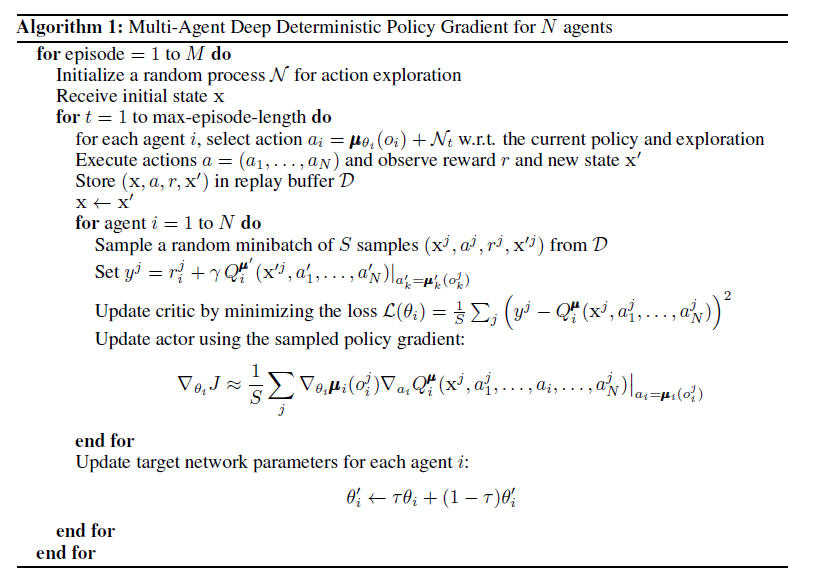
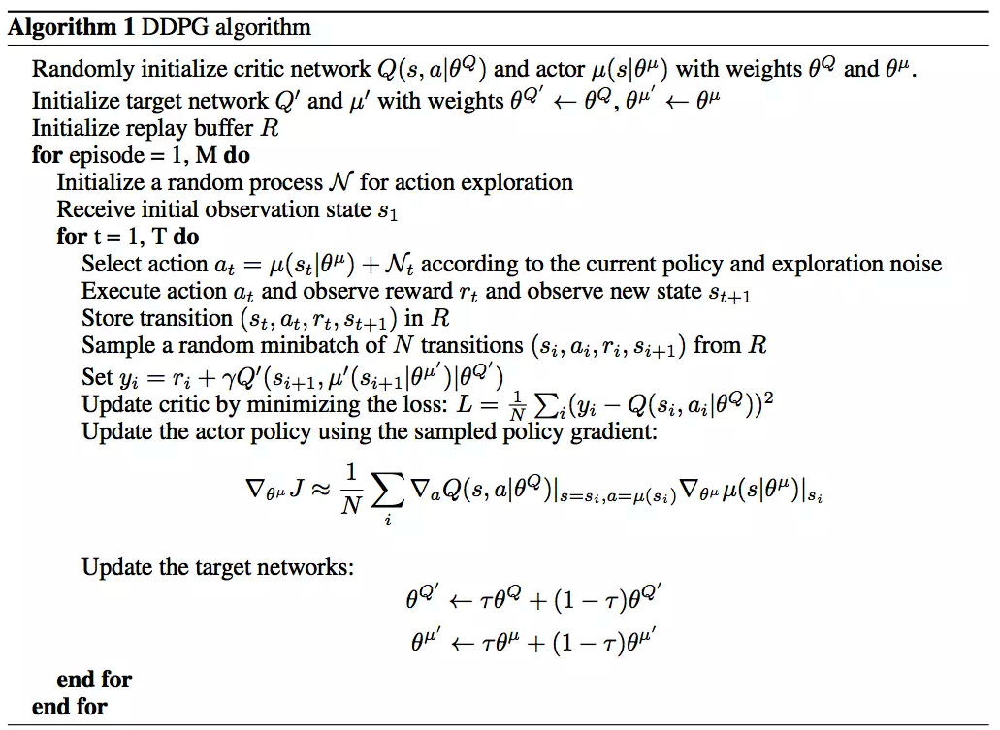
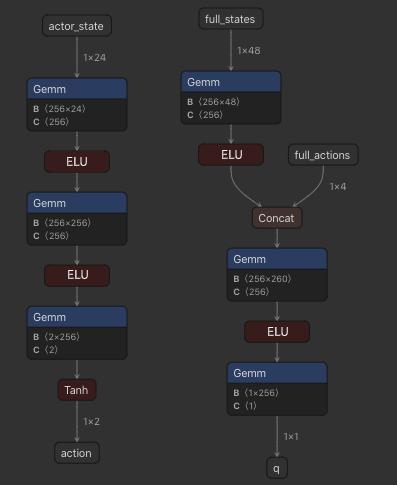
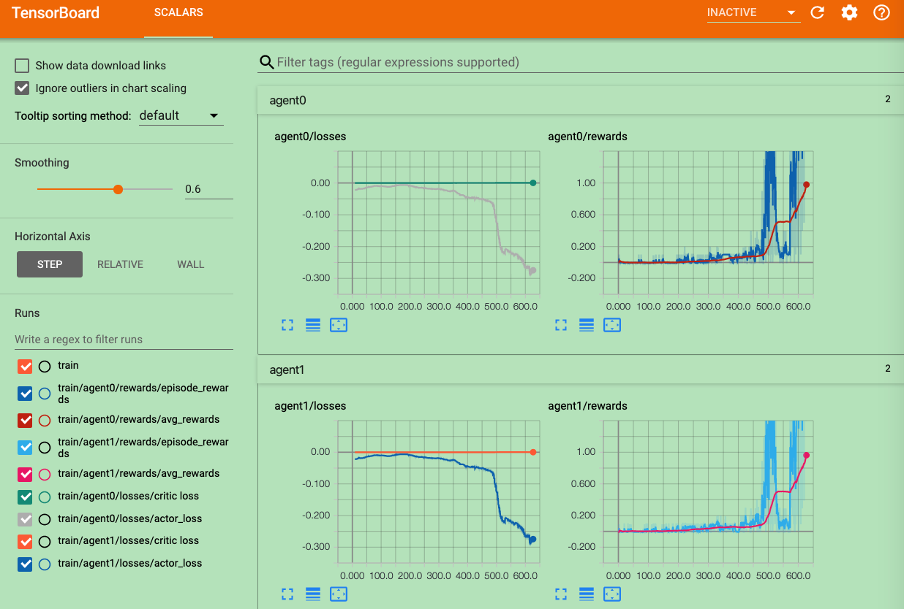

# Report

This report is my third project of Udacity's Deep Reinforcement Learning on the Unity Tennis Environment. The goal of the project is to train two robots to play tennis. Here, we used [MADDPG (Multi-Agent Deep Deterministic Policy Gradient)](https://arxiv.org/abs/1706.02275) to solve the problem. 

## 1. Algorithm Introduction

MADDPG algorithm, as it can be seen from its name, is used for multi-agent environments and allows agents to learn to collaborate or compete with each other.

MADDPG extends a reinforced learning algorithm called [DDPG](https://arxiv.org/abs/1509.02971)(the following), which is derived from [actor-critc reinforcement learning]() techniques and struggle to learn in multiagent environments, as at every time step each agent will be trying to learn to predict the actions of other agents while also taking its own actions. MADDPG employs a centralized critic to supply agents with information about their peers' observations and potential actions, transforming an unpredictable environment into a predictable one, which also reduce the reward inconsistency and lower learing variance. 


<center>Training and Execution</center>

These two algorithms are as follows:


<center>MADDPG Algorithm</center>



<center>DDPG Algorithm</center>

## 2. Project

In this project, the followings are the actor critic network structures:



<center>Actor Network (left) and Critic Network (right)</center>

Here are the hyper-paramters:

```text
SEED = 1  # random seed

N_EPISODES = 2300  # total training epoches

GAMMA = 0.99  # discount ratio
TAU = 0.01  # interpolation factor of local model and target model

# exploitation and explorationin
EPS_START = 1.0
EPS_DECAY = 3e-4
EPS_END = 0.0005
EPISODES_BEFORE_TRAINING = 100  # Agent take random actions below the episodes

# amplitude of OU noise
# this slowly decreases to NOISE_END, total_count = log(NOISE_END/NOISE_START)/log(NOISE_REDUCTION)
NOISE_START = 2
NOISE_REDUCTION = 0.9997  # 0.999 -> 2995, 0.9997 -> 9985, 0.9998 -> 14978, 0.9999 -> 29956
NOISE_END = 0.1

# training steps
TRAIN_EVERY_STEPS = 5
NUM_LEARN_STEPS_PER_ENV_STEP = 3  # how many times training of the step

# actor model
ACTOR_HIDDEN_UNITS = (256, 256)
ACTOR_LR = 1e-4
ACTOR_WEIGHT_DECAY = 1e-5

# critic model
CRITIC_HIDDEN_UNITS = (256, 256)
CRITIC_LR = 5e-4
CRITIC_WEIGHT_DECAY = 1e-5

# replay buffer
BATCH_SIZE = 256
BUFFER_SIZE = int(1e6)
```

The rewards and losses during training are shown below. From the following snapshot, it takes about 650 epoches to reach 1.0 average rewards of latest 100 epoches, I had to early stop the training, because if we train too much longer time, the model is not behave good as expected.



<center>Training scores and losses</center>

## 3. Future Work

In the near future, using distribute frameworks, such as ray, to train in a ditributed system.

